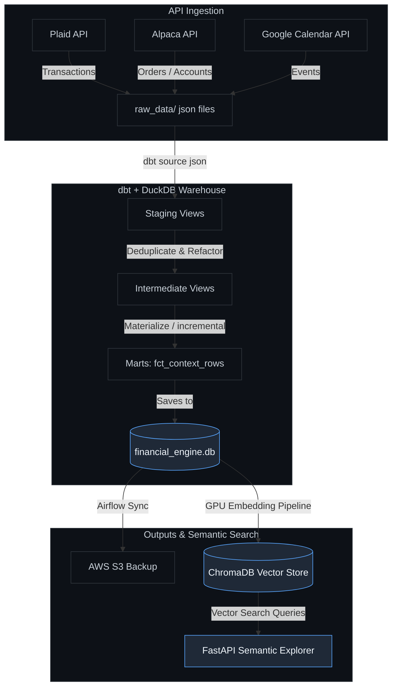

# 🌌 Financial & Communication Context ELT Pipeline

An end-to-end, hardware-accelerated financial intelligence data pipeline and semantic explorer. It extracts data from multiple external APIs, transforms and models raw data using **dbt + DuckDB**, synchronizes analytical states with **AWS S3**, and computes vectorized embeddings for **ChromaDB semantic search** utilizing local GPU acceleration.

---

## 🚀 Key Features

*   **Multi-Source API Ingestion (`extract/`):** Robust extractors for Alpaca Markets (account & orders data), Plaid (transaction history), and Google Calendar (communication context).
*   **Analytical Warehouse (`transform/`):** A lightweight, high-performance DuckDB local warehouse modeled through dbt (staging, intermediate, and marts layers).
*   **Local GPU Vectorization (`vector_prep/`):** High-speed embedding generation on local GPU (optimized for RTX 4070/CUDA) using PyTorch and `sentence-transformers` (`all-MiniLM-L6-v2`), upserted incrementally to ChromaDB.
*   **Semantic Context Explorer Dashboard:** A FastAPI-based interactive web interface providing live database statistics, device/model status, and real-time semantic query results.
*   **Airflow Orchestration (`orchestration/`):** Astronomer Astro-managed DAG workflows that schedule ingestion, dbt builds, and backup database syncs to AWS S3.

---

## 🗺️ System Architecture



---

## 📂 Project Structure

```text
financial-context-elt-pipeline/
├── config/
│   └── pipeline_config.yaml    # Global parameters & extractor query configurations
├── extract/
│   ├── base_client.py          # Resilient API client with pagination & retries
│   ├── alpaca_extractor.py     # Alpaca orders/accounts extraction
│   ├── plaid_extractor.py      # Plaid sandbox transactions extraction
│   ├── google_calendar_extractor.py # OAuth2 Google Calendar events extraction
│   └── run_extraction.py       # Main ingestion runner
├── load/
│   └── file_writer.py          # Ingestion landing zone JSON writer
├── orchestration/              # Astronomer Airflow project configuration
│   ├── dags/
│   │   └── financial_context_dag.py # Complete pipeline orchestration DAG
│   └── Dockerfile              # Astronomer Airflow docker image overrides
├── raw_data/                   # Local landing directory for raw extraction payloads (Git ignored)
├── transform/                  # dbt models project
│   ├── models/                 # staging, intermediate, and marts sql models
│   ├── profiles.yml            # dbt configurations for DuckDB target
│   └── dbt_project.yml         # dbt settings, materialization types, and source variables
├── vector_prep/                # Semantic search integration
│   ├── app.py                  # FastAPI server & Semantic Explorer Web Dashboard
│   ├── embed_context.py        # CUDA hardware checker, embed generator & ChromaDB loader
│   ├── vector_client.py        # Local ChromaDB connection client wrapper
│   └── verify_embeddings.py    # Command-line query verification script
├── requirements.txt            # Python environments & packages list
└── financial_engine.db         # Compiled DuckDB warehouse file (generated)
```

---

## 🛠️ Setup & Installation

### Prerequisites
*   **Python:** `3.10` or higher recommended.
*   **GPU Drivers:** NVIDIA GPU with CUDA setup (required for high-performance PyTorch embedding generation).
*   **Docker:** Required for running the local Airflow/Astronomer orchestration.

### Step 1: Clone the Repository
```bash
git clone https://github.com/haseebkn/financial-context-elt-pipeline.git
cd financial-context-elt-pipeline
```

### Step 2: Create a Virtual Environment & Install Dependencies
```bash
python -m venv venv
# On Windows:
.\venv\Scripts\activate
# On Linux/macOS:
source venv/bin/activate

# Install core dependencies and PyTorch configured for CUDA
pip install -r requirements.txt
```

### Step 3: Configure Environment Secrets (`.env`)
Create a `.env` file in the project root directory and populate it with your credentials:

```ini
# General Configuration
ENVIRONMENT=development
LOG_LEVEL=INFO
RAW_DATA_DIR=e:/Financial Data Engineering Pipeline/raw_data

# Alpaca Markets API Credentials (Paper/Sandbox)
ALPACA_API_KEY_ID=your_alpaca_key
ALPACA_API_SECRET_KEY=your_alpaca_secret
ALPACA_IS_PAPER=True

# Plaid API Credentials (Sandbox)
PLAID_CLIENT_ID=your_plaid_client_id
PLAID_SECRET=your_plaid_secret
PLAID_ENVIRONMENT=sandbox
PLAID_ACCESS_TOKEN=your_plaid_access_token

# Google Calendar API Credentials
# (Ensure credentials.json is placed in the root directory for initial login auth flow)
GOOGLE_APPLICATION_CREDENTIALS=e:/Financial Data Engineering Pipeline/credentials.json
GOOGLE_TOKEN_PATH=e:/Financial Data Engineering Pipeline/token.json
GOOGLE_CALENDAR_ID=primary

# AWS S3 Cloud Integration (State backup)
AWS_ACCESS_KEY_ID=your_aws_access_key
AWS_SECRET_ACCESS_KEY=your_aws_secret_key
AWS_DEFAULT_REGION=us-east-1
AWS_S3_BUCKET=your_s3_bucket_name
```

---

## ⚙️ How to Run the Pipeline (Manual Mode)

You can run individual components of the pipeline manually directly from your terminal:

### 1. Ingest Data
Executes extraction pipelines for Calendar, Alpaca, and Plaid APIs, storing raw JSON files inside `raw_data/`:
```bash
python extract/run_extraction.py
```

### 2. Run dbt Transformations
Builds the DuckDB warehouse, compiling raw JSON views into staging, intermediate, and marts tables (`financial_engine.db`):
```bash
cd transform
dbt build
cd ..
```

### 3. Compute Embeddings & Load to Vector Store
Processes data from the analytical dbt models, generates PyTorch embeddings on your GPU, and stores them in ChromaDB:
```bash
python vector_prep/embed_context.py
```

### 4. Query & Verify Embeddings
Run a sample semantic search query via CLI to verify database contents:
```bash
python vector_prep/verify_embeddings.py
```

### 5. Launch the Web UI Dashboard
Spin up the fastapi server to launch the **Semantic Context Explorer UI** at [http://localhost:8000](http://localhost:8000):
```bash
uvicorn vector_prep.app:app --host 0.0.0.0 --port 8000 --reload
```

---

## 🔄 Pipeline Orchestration (Astronomer Airflow)

If you prefer to run the entire pipeline automatically on a scheduled, orchestrated frequency, use Astronomer:

1.  **Navigate to the orchestration directory:**
    ```bash
    cd orchestration
    ```
2.  **Start Airflow dev containers:**
    ```bash
    astro dev start
    ```
3.  **Access Airflow Dashboard:**
    Open [http://localhost:8080](http://localhost:8080) and log in using user `admin` and password `admin`.
4.  **Execute the DAG:**
    Trigger the `financial_communication_context_engine` DAG. It will automatically run the ingestion script, build dbt models, and synchronize `financial_engine.db` with your AWS S3 bucket.
