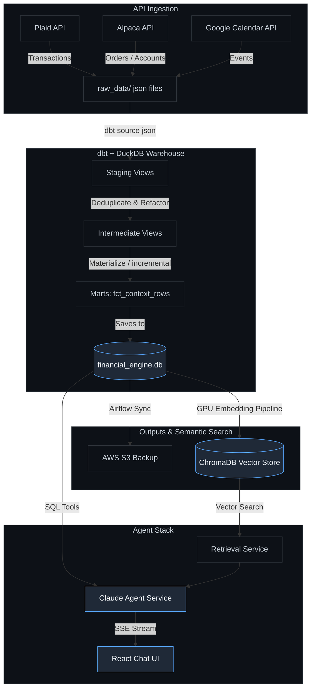

# 🌌 Financial & Communication Context Engine

[](https://github.com/haseebkn/financial-context-elt-pipeline/actions/workflows/ci.yml)

This project has two layers, built in that order. The first is a conventional but genuinely solid ELT pipeline: extract Alpaca trades, Plaid transactions, and Google Calendar events into a landing zone, model them through dbt into a DuckDB warehouse, embed the narrative rows for semantic search, and orchestrate the whole thing on Airflow. The second layer is the reason the first one exists — a tool-using Claude agent that answers questions like *"did I go rock climbing recently?"* or *"how much did I spend on Food and Drink?"* by actually querying that warehouse, with the guardrails, citation tracking, and observability that separate a demo from something you'd trust with real financial data.

The split matters because it's the difference between wiring an LLM up to an API and building the infrastructure an agent needs to be trustworthy: a SQL guard the model can't talk its way around, answers that cite the row they came from, spans and cost accounting for every turn, and an eval harness that scores tool choice and recall instead of vibes. Fintech is a domain where "the agent sounded right" isn't good enough — this repo is an attempt to build the parts that make it actually right, or fail loudly when it isn't.

---

## 🚀 Key Features

*   **Tool-Using Claude Agent (`agent/`):** Answers financial questions by calling real warehouse tools — `search_context`, `query_warehouse`, `get_portfolio_snapshot`, `summarize_spend` — never from prior knowledge. Freeform SQL is gated by a table allowlist and banned-function blocklist (`lib/sql-guard.ts`); every claim in an answer is checked against a cited row before it reaches the user.
*   **Observability built in, not bolted on:** Every turn writes a span-level trace (LLM calls, tool executions, citation checks) into the same warehouse the agent queries — `/api/metrics` computes turns/day, error and repair rates, cache-hit rate, cost, and latency percentiles with real SQL against that trace data, not counters kept in memory.
*   **An eval harness that scores agents, not vibes (`agent/evals/`):** Tool-choice accuracy, retrieval recall, and an LLM-judge score (sampled n=3, spread reported rather than trusted as a point estimate) against a golden set of questions — gated into CI.
*   **React Chat Frontend (`web/`):** A streaming SSE chat UI with inline citation chips and a per-message trace waterfall, plus Metrics and Evals tabs backed directly by the warehouse.
*   **Analytical Warehouse (`transform/`):** A dbt-modeled DuckDB warehouse (staging → marts) over trades, transactions, calendar events, and the agent's own traces.
*   **Multi-Source API Ingestion (`extract/`):** Extractors for Alpaca Markets, Plaid, and Google Calendar, orchestrated by Astronomer Airflow with backup sync to AWS S3.
*   **Local GPU Vectorization (`vector_prep/`):** `sentence-transformers` embeddings generated on local GPU (CUDA), upserted incrementally to ChromaDB and served to the agent through an internal retrieval service.
*   **Containerized and deployable (`infra/aws/`):** Production Dockerfiles for all three services and a Terraform stack (ECS Fargate, ALB, EFS, Secrets Manager) to run them on AWS.

---

## 🗺️ System Architecture


```mermaid
graph TD
    %% Ingestion Stage
    subgraph Ingestion [API Ingestion]
        Plaid[Plaid API] -->|Transactions| RawData[raw_data/ json files]
        Alpaca[Alpaca API] -->|Orders / Accounts| RawData
        GCal[Google Calendar API] -->|Events| RawData
    end

    %% Transformation Stage
    subgraph Warehouse [dbt + DuckDB Warehouse]
        RawData -->|dbt source json| Staging[Staging Views]
        Staging -->|Deduplicate & Refactor| Intermediate[Intermediate Views]
        Intermediate -->|Materialize / incremental| Marts[Marts: fct_context_rows]
        Marts -->|Saves to| DuckDB[(financial_engine.db)]
    end

    %% Sync & Vectorization Stage
    subgraph Outputs [Outputs & Semantic Search]
        DuckDB -->|Airflow Sync| S3[AWS S3 Backup]
        DuckDB -->|GPU Embedding Pipeline| Chroma[(ChromaDB Vector Store)]
    end

    subgraph AgentStack [Agent Stack]
        Chroma -->|Vector Search| Retrieval[Retrieval Service]
        DuckDB -->|SQL Tools| Agent[Claude Agent Service]
        Retrieval --> Agent
        Agent -->|SSE Stream| Web[React Chat UI]
    end

    classDef default fill:#0d1117,stroke:#30363d,color:#c9d1d9;
    classDef highlight fill:#1f2937,stroke:#58a6ff,color:#f0f6fc;
    class Ingestion,Warehouse,Outputs,AgentStack default;
    class DuckDB,Chroma,Agent,Web highlight;
```

---

## 📂 Project Structure

```text
financial-context-elt-pipeline/
├── config/
│   └── pipeline_config.yaml    # Global parameters & extractor query configurations
├── extract/
│   ├── base_client.py          # Resilient API client with pagination & retries
│   ├── alpaca_extractor.py     # Alpaca orders/accounts extraction
│   ├── plaid_extractor.py      # Plaid sandbox transactions extraction
│   ├── google_calendar_extractor.py # OAuth2 Google Calendar events extraction
│   └── run_extraction.py       # Main ingestion runner
├── load/
│   └── file_writer.py          # Ingestion landing zone JSON writer
├── orchestration/              # Astronomer Airflow project configuration
│   ├── dags/
│   │   └── financial_context_dag.py # Complete pipeline orchestration DAG
│   └── Dockerfile              # Astronomer Airflow docker image overrides
├── raw_data/                   # Local landing directory for raw extraction payloads (Git ignored)
├── transform/                  # dbt models project
│   ├── models/                 # staging, intermediate, and marts sql models
│   ├── profiles.yml            # dbt configurations for DuckDB target
│   └── dbt_project.yml         # dbt settings, materialization types, and source variables
├── vector_prep/                 # Semantic search integration
│   ├── app.py                   # FastAPI stats/search API (no UI — see web/ for the frontend)
│   ├── retrieval_service.py     # Internal retrieval service used by the agent
│   ├── embed_context.py         # CUDA hardware checker, embed generator & ChromaDB loader
│   ├── vector_client.py         # Local ChromaDB connection client wrapper
│   └── verify_embeddings.py     # Command-line query verification script
├── agent/                       # Node/TypeScript Claude agent service (see agent/README.md)
├── web/                         # React chat frontend for the agent (Chat / Metrics / Evals)
├── requirements.txt             # Python environments & packages list
└── financial_engine.db          # Compiled DuckDB warehouse file (generated)
```

---

## 🛠️ Setup & Installation

### Prerequisites
*   **Python:** `3.10` or higher recommended.
*   **GPU Drivers:** NVIDIA GPU with CUDA setup (required for high-performance PyTorch embedding generation).
*   **Docker:** Required for running the local Airflow/Astronomer orchestration.

### Step 1: Clone the Repository
```bash
git clone https://github.com/haseebkn/financial-context-elt-pipeline.git
cd financial-context-elt-pipeline
```

### Step 2: Create a Virtual Environment & Install Dependencies
```bash
python -m venv venv
# On Windows:
.\venv\Scripts\activate
# On Linux/macOS:
source venv/bin/activate

# Install core dependencies and PyTorch configured for CUDA
pip install -r requirements.txt
```

### Step 3: Configure Environment Secrets (`.env`)
Create a `.env` file in the project root directory and populate it with your credentials:

```ini
# General Configuration
ENVIRONMENT=development
LOG_LEVEL=INFO
RAW_DATA_DIR=./raw_data

# Alpaca Markets API Credentials (Paper/Sandbox)
ALPACA_API_KEY_ID=your_alpaca_key
ALPACA_API_SECRET_KEY=your_alpaca_secret
ALPACA_IS_PAPER=True

# Plaid API Credentials (Sandbox)
PLAID_CLIENT_ID=your_plaid_client_id
PLAID_SECRET=your_plaid_secret
PLAID_ENVIRONMENT=sandbox
PLAID_ACCESS_TOKEN=your_plaid_access_token

# Google Calendar API Credentials
# (Ensure credentials.json is placed in the root directory for initial login auth flow)
GOOGLE_APPLICATION_CREDENTIALS=./credentials.json
GOOGLE_TOKEN_PATH=./token.json
GOOGLE_CALENDAR_ID=primary

# AWS S3 Cloud Integration (State backup)
AWS_ACCESS_KEY_ID=your_aws_access_key
AWS_SECRET_ACCESS_KEY=your_aws_secret_key
AWS_DEFAULT_REGION=us-east-1
AWS_S3_BUCKET=your_s3_bucket_name
```

---

## ⚙️ How to Run the Pipeline (Manual Mode)

You can run individual components of the pipeline manually directly from your terminal:

### 1. Ingest Data
Executes extraction pipelines for Calendar, Alpaca, and Plaid APIs, storing raw JSON files inside `raw_data/`:
```bash
python extract/run_extraction.py
```

### 2. Run dbt Transformations
Builds the DuckDB warehouse, compiling raw JSON views into staging, intermediate, and marts tables (`financial_engine.db`):
```bash
cd transform
dbt build
cd ..
```

### 3. Compute Embeddings & Load to Vector Store
Processes data from the analytical dbt models, generates PyTorch embeddings on your GPU, and stores them in ChromaDB:
```bash
python vector_prep/embed_context.py
```

### 4. Query & Verify Embeddings
Run a sample semantic search query via CLI to verify database contents:
```bash
python vector_prep/verify_embeddings.py
```

### 5. Launch the Agent + Chat Frontend
Three services make up the agent stack: the retrieval service (semantic search over ChromaDB), the agent service (the Claude tool-using loop + REST/SSE API), and the React chat UI.

```bash
# Terminal 1 — retrieval service
uvicorn vector_prep.retrieval_service:app --host 127.0.0.1 --port 8100

# Terminal 2 — agent service
cd agent && npm install && npm run dev

# Terminal 3 — web frontend
npm install --workspace web
npm run dev --workspace web
```

Open [http://localhost:5173](http://localhost:5173) for the chat UI — it proxies `/api/*` to the agent service and includes Chat, Metrics, and Evals tabs.

See [`agent/README.md`](agent/README.md) for the agent's architecture, tool descriptions, and setup, and [`web/README.md`](web/README.md) for the frontend.

`vector_prep/app.py` also exposes a plain `/api/stats` and `/api/search` for ad hoc semantic queries against ChromaDB, independent of the agent stack:
```bash
uvicorn vector_prep.app:app --host 0.0.0.0 --port 8000 --reload
```

---

## 🔄 Pipeline Orchestration (Astronomer Airflow)

If you prefer to run the entire pipeline automatically on a scheduled, orchestrated frequency, use Astronomer:

1.  **Navigate to the orchestration directory:**
    ```bash
    cd orchestration
    ```
2.  **Start Airflow dev containers:**
    ```bash
    astro dev start
    ```
3.  **Access Airflow Dashboard:**
    Open [http://localhost:8080](http://localhost:8080) and log in using user `admin` and password `admin`.
4.  **Execute the DAG:**
    Trigger the `financial_communication_context_engine` DAG. It will automatically run the ingestion script, build dbt models, and synchronize `financial_engine.db` with your AWS S3 bucket.

---

## ☁️ AWS Deployment

The agent, retrieval, and web services each have a production `Dockerfile` (`agent/Dockerfile`, `vector_prep/Dockerfile`, `web/Dockerfile`) and are provisioned on AWS via Terraform under [`infra/aws/`](infra/aws): ECS Fargate for all three services, an ALB routing `/api/*` to the agent and everything else to the static frontend, EFS for the shared DuckDB warehouse file and ChromaDB store, Secrets Manager for credentials, and Cloud Map for internal agent → retrieval service discovery.

```bash
cd infra/aws
terraform init
cp terraform.tfvars.example terraform.tfvars   # fill in secrets, don't commit it
terraform apply
```

See [`infra/aws/README.md`](infra/aws/README.md) for the architecture diagram, cost estimate, and image build/push steps, and [`.github/workflows/deploy.yml`](.github/workflows/deploy.yml) for the manual-dispatch CI workflow that automates them.

---

## 🧭 Engineering notes

A few decisions worth being explicit about, in case they read as gaps rather than choices:

*   **No `ANTHROPIC_API_KEY` was available while building the agent.** Every piece of orchestration around the model call — the SQL guard, citation validation, usage accounting, SSE framing, all four tools against the real warehouse — has real test coverage. The live model-calling path itself is covered by a smoke test that makes a genuine network call to `api.anthropic.com` and asserts on the structured *authentication* error it gets back, which proves the request is well-formed without proving what the model actually says. That's a real gap, not a hidden one — see `agent/README.md`'s "Known limitation" for how to close it.
*   **CI doesn't fake coverage it doesn't have.** Where fixture data doesn't match production data shape closely enough to make a green check mean something, the gap is documented rather than wired into a misleading gate.
*   **The AWS deployment optimizes for cost over isolation** (public subnets instead of a NAT gateway, no HTTPS without a real domain) — a reasonable trade for a single-service portfolio deploy, explicitly not a template for a workload handling real funds. See `infra/aws/README.md` for the reasoning.
*   **Two real bugs were caught by testing against real state instead of trusting the first green run:** an incremental dbt model using the wrong watermark column, and a `view`-materialized model whose `read_json_auto()` path resolved against the caller's working directory instead of build time — both invisible until something queried the model from a different directory than the one it was built from.
